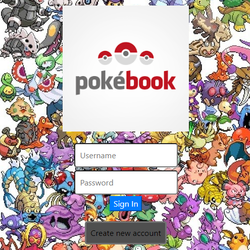

  # PokeBook
  

  
  
  
  ## Description
  A new social media site for Pokemon lovers, where you can connect with other Pokemon lovers and share messages.

  ### Tools and Languages used
  ##### Frontend:

##### Backend:

#### Dependencies:

  ## Table of Contents
  
  - [Usage](#usage)
  - [Screenshots](#screenshots)
  - [Contribution](#contribution)
  - [Links](#links)
  
  ## Usage
When you sign-up you will take a small quiz to decide your Pokemon avatar and color scheme.
    

  ## Screenshots
  

  ## Contribution
Contributers will push to feature branches and enter pull requests to push to develop and main.

Founding Contributers:

Cameron Cole

Derek Madderom

Chris Burton

Emma Coughlin

Vue Lee

    
  ## Links
  GitHub Repository: https://github.com/Wizzle13/pokebook

  Heroku URL: https://the-poke-book.herokuapp.com/

  &copy;2020 by Chris Burton
